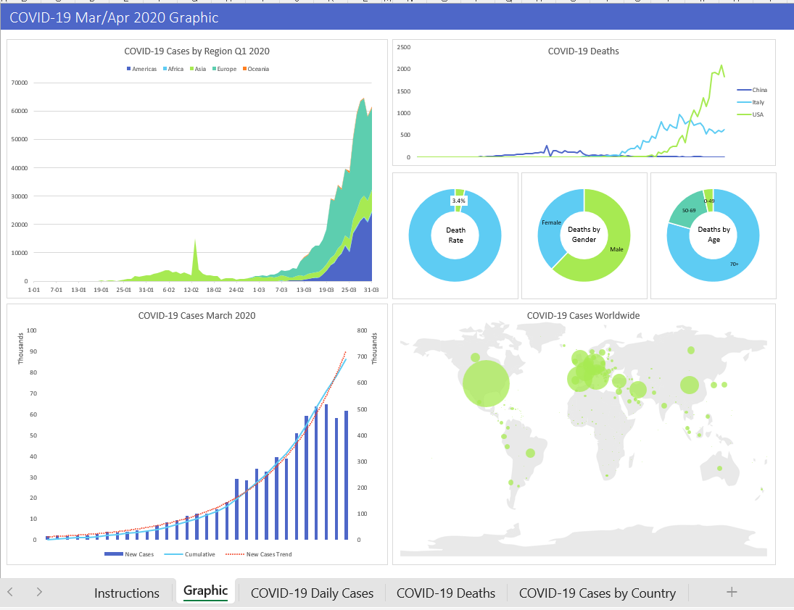

# COVID-19 Analytics Dashboard (Excel)

## Overview
This project is an Excel-based analytics dashboard that visualizes COVID-19 trends using structured data, calculated metrics, and reporting visuals.

It highlights real-world analyst skills: preparing data, creating calculated fields, and building executive-friendly dashboards that support trend monitoring and comparison across countries.

---

## Dashboard Contents
- Daily COVID-19 cases trend
- Daily COVID-19 deaths trend
- Cases by country comparison
- Supporting calculation sheet used to drive visuals

---

## Skills Demonstrated
- Excel data preparation and organization
- Analytical calculations (helper tables / metrics)
- Dashboard design and layout
- Chart building and formatting
- Building an insight-driven report (not just charts)

---

## Preview

---

